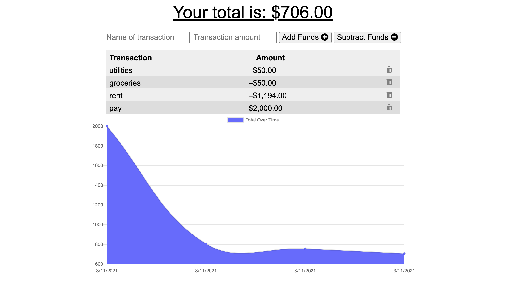

# Budget-Tracker
A budget tracker that can function both online and offline.

## Table of Contents
1. [ Description ](#desc)
1. [ Visuals ](#visuals)
1. [ Deployed Webpage ](#deployed)
1. [ Support ](#support)
1. [ Next Steps ](#next_steps)
1. [ Authors and Acknowledgement ](#acknowledge)
1. [ License ](#license)

## 1. Description
A budget tracker that can also function offline and syncs seamlessly when online. It also has a cool graph that shows the amount of money you have left (or are in debt).

### Note:
I also added the ability for transactions to be deleted in case you made a mistake.

### Summary of Functionality

* You can either add or subtract funds by clicking of the correspoding buttons. Once the transaction is added, you may delete it by clicking on the trash can next to that transaction.

## 2. Visuals
Screenshot of the webpage.

## 3. Deployed Webpage
[The deployed site](https://tasha876.github.io/Work-Day-Scheduler/index.html), hosted by Heroku.

## 4. Support
Should you find an issue with this webpage, please create a [new issue](https://github.com/Tasha876/Budget-Tracker/issues/new/choose) on my GitHub repository.

## 5. Next steps
Several features could be added, some of these include (but are in no way limited to):
- better UI (right now it looks a little plain)
- improve benchmark scores

## 6. Authors and Acknowledgement
This site was created by Natasha Fray using JavaScript with indexedDB, *most of* the styling and the idea of the website was provided by the [UofT SCS Coding Bootcamp](https://bootcamp.learn.utoronto.ca/).

## 7. License
This project is covered by the [MIT](LICENSE) license.

